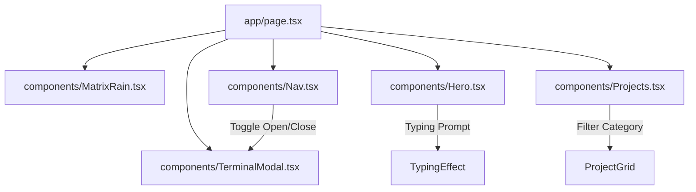

# Matrix Retro CRT Portfolio Implementation Plan

> **For agentic workers:** REQUIRED SUB-SKILL: Use superpowers:subagent-driven-development to implement this plan task-by-task. Steps use checkbox (`- [ ]`) syntax for tracking.

**Goal:** Enhance the Next.js portfolio website for Muhammad Hassan Mughal with a high-end Matrix CRT aesthetic featuring a Matrix digital rain canvas, interactive CLI terminal drawer, command line typing effects, and retro card interactions while preserving existing styling tokens and zero-npm dependency constraint.

**Architecture:**
The application retains its single-page layout structure. A new lightweight Canvas component (`MatrixRain.tsx`) provides falling phosphor trail animations behind the main section. A command-line drawer modal (`TerminalModal.tsx`) handles interactive CLI inputs (`help`, `about`, `projects`, `skills`, `contact`, `cat resume`, `clear`), triggered via a button in the `Nav.tsx` or `Hero.tsx` components.

**Architecture Diagram:**



**Tech Stack:** Next.js 15 (App Router), TypeScript, Tailwind CSS v4, HTML5 Canvas API, CSS Keyframe Animations (No external npm packages).

## Global Constraints

- **No UI Libraries**: No Radix, no Framer Motion, no lucide-react. Pure CSS and HTML5 Canvas only.
- **Colors**: Strictly `--amber: #ffb000`, `--amber-dim: #b07800`, `--green: #39ff14`, `--bg: #0a0800`, `--bg-panel: #0f0c00`.
- **Fonts**: VT323 (display/headings), Share Tech Mono (labels/UI/code), Courier Prime (body).
- **Cursor**: `cursor: none` preserved across all interactive elements.

---

### Task 1: Matrix Rain Canvas Background (`components/MatrixRain.tsx`)

**Files:**
- Create: [`components/MatrixRain.tsx`](file:///C:/Users/Dawood%20Tanvir/Desktop/Coding/my-portfolio-website/components/MatrixRain.tsx)

**Interfaces:**
- Produces: `export function MatrixRain({ opacity }: { opacity?: number })`

- [ ] **Step 1: Create `MatrixRain.tsx` component**

```tsx
"use client";

import { useEffect, useRef } from "react";

type MatrixRainProps = {
  opacity?: number;
};

export function MatrixRain({ opacity = 0.25 }: MatrixRainProps) {
  const canvasRef = useRef<HTMLCanvasElement | null>(null);

  useEffect(() => {
    const canvas = canvasRef.current;
    if (!canvas) return;

    const ctx = canvas.getContext("2d");
    if (!ctx) return;

    let animationFrameId: number;

    const handleResize = () => {
      canvas.width = window.innerWidth;
      canvas.height = window.innerHeight;
    };

    handleResize();
    window.addEventListener("resize", handleResize);

    const chars = "0123456789ABCDEFｦｱｳｴｵｶｷｹｺｻｼｽｾｿﾀﾂﾃﾅﾆﾇﾈﾊﾋﾎﾏﾐﾑﾒﾓﾔﾕﾗﾘﾜ";
    const fontSize = 14;
    const columns = Math.floor(canvas.width / fontSize);
    const drops: number[] = Array(columns).fill(1);

    const draw = () => {
      ctx.fillStyle = "rgba(10, 8, 0, 0.1)";
      ctx.fillRect(0, 0, canvas.width, canvas.height);

      ctx.font = `${fontSize}px var(--font-mono), monospace`;

      for (let i = 0; i < drops.length; i++) {
        const text = chars[Math.floor(Math.random() * chars.length)];
        const isGreen = Math.random() > 0.85;
        
        ctx.fillStyle = isGreen ? "#39ff14" : "#ffb000";
        ctx.shadowColor = isGreen ? "rgba(57, 255, 20, 0.5)" : "rgba(255, 176, 0, 0.5)";
        ctx.shadowBlur = 4;

        ctx.fillText(text, i * fontSize, drops[i] * fontSize);

        if (drops[i] * fontSize > canvas.height && Math.random() > 0.975) {
          drops[i] = 0;
        }
        drops[i]++;
      }

      animationFrameId = requestAnimationFrame(draw);
    };

    draw();

    return () => {
      window.removeEventListener("resize", handleResize);
      cancelAnimationFrame(animationFrameId);
    };
  }, []);

  return (
    <canvas
      ref={canvasRef}
      aria-hidden="true"
      className="pointer-events-none fixed inset-0 z-0 transition-opacity duration-500"
      style={{ opacity }}
    />
  );
}
```

- [ ] **Step 2: Verify type check**

Run: `npm run type-check`  
Expected: PASS with 0 errors.

- [ ] **Step 3: Commit**

```bash
git add components/MatrixRain.tsx
git commit -m "feat: add MatrixRain HTML5 Canvas component"
```

---

### Task 2: Interactive Matrix CRT CLI Terminal Overlay (`components/TerminalModal.tsx`)

**Files:**
- Create: [`components/TerminalModal.tsx`](file:///C:/Users/Dawood%20Tanvir/Desktop/Coding/my-portfolio-website/components/TerminalModal.tsx)

**Interfaces:**
- Consumes: `identity`, `projects`, `skills`, `contact` from [`components/portfolio-data.ts`](file:///C:/Users/Dawood%20Tanvir/Desktop/Coding/my-portfolio-website/components/portfolio-data.ts)
- Produces: `export function TerminalModal({ isOpen, onClose }: { isOpen: boolean; onClose: () => void })`

- [ ] **Step 1: Create `TerminalModal.tsx` component with keyboard event handling and commands**

```tsx
"use client";

import { useEffect, useRef, useState } from "react";
import { contact, identity, projects, skills } from "./portfolio-data";

type TerminalModalProps = {
  isOpen: boolean;
  onClose: () => void;
};

type HistoryEntry = {
  command: string;
  output: string | React.ReactNode;
};

export function TerminalModal({ isOpen, onClose }: TerminalModalProps) {
  const [input, setInput] = useState("");
  const [history, setHistory] = useState<HistoryEntry[]>([
    {
      command: "welcome",
      output: (
        <div className="space-y-1">
          <p className="text-[#39ff14]">Matrix CRT Interactive Terminal v1.0.0</p>
          <p className="text-[#b07800]">Type <span className="text-[#ffb000]">&apos;help&apos;</span> for available commands or <span className="text-[#ffb000]">&apos;exit&apos;</span> to close.</p>
        </div>
      ),
    },
  ]);

  const inputRef = useRef<HTMLInputElement>(null);
  const bottomRef = useRef<HTMLDivElement>(null);

  useEffect(() => {
    if (isOpen) {
      setTimeout(() => inputRef.current?.focus(), 100);
    }
  }, [isOpen]);

  useEffect(() => {
    bottomRef.current?.scrollIntoView({ behavior: "smooth" });
  }, [history]);

  if (!isOpen) return null;

  const handleCommand = (cmdStr: string) => {
    const trimmed = cmdStr.trim().toLowerCase();
    let output: React.ReactNode = "";

    switch (trimmed) {
      case "help":
        output = (
          <div className="space-y-1 text-[#b07800]">
            <p className="text-[#ffb000]">Available commands:</p>
            <p><span className="text-[#39ff14]">about</span>      - Summary of background & experience</p>
            <p><span className="text-[#39ff14]">projects</span>   - List featured SaaS and mobile projects</p>
            <p><span className="text-[#39ff14]">skills</span>     - Display tech stack breakdown</p>
            <p><span className="text-[#39ff14]">contact</span>    - Print contact details & socials</p>
            <p><span className="text-[#39ff14]">cat resume</span> - Print resume overview link</p>
            <p><span className="text-[#39ff14]">clear</span>      - Clear terminal history</p>
            <p><span className="text-[#39ff14]">exit</span>       - Close terminal window</p>
          </div>
        );
        break;
      case "about":
        output = `${identity.name} — ${identity.role}. Specializing in ${identity.specialization} (${identity.experience}). Current role: ${identity.currentRole}. Location: ${identity.location}.`;
        break;
      case "projects":
        output = (
          <ul className="list-disc pl-4 space-y-1 text-[#b07800]">
            {projects.map((p) => (
              <li key={p.id}>
                <strong className="text-[#ffb000]">{p.name}</strong> ({p.stack.join(", ")}): {p.summary}
              </li>
            ))}
          </ul>
        );
        break;
      case "skills":
        output = (
          <div className="space-y-2">
            {skills.map((group) => (
              <div key={group.title}>
                <p className="text-[#39ff14]">// {group.title}</p>
                <p className="text-[#b07800]">{group.items.map((i) => i.label).join(" • ")}</p>
              </div>
            ))}
          </div>
        );
        break;
      case "contact":
        output = `Email: ${contact.email} | GitHub: ${contact.github} | LinkedIn: ${contact.linkedin}`;
        break;
      case "cat resume":
        output = `Resume PDF: ${contact.resume} (Opening download...)`;
        window.open(contact.resume, "_blank");
        break;
      case "clear":
        setHistory([]);
        return;
      case "exit":
        onClose();
        return;
      case "":
        output = "";
        break;
      default:
        output = `Command not recognized: '${trimmed}'. Type 'help' for available commands.`;
    }

    setHistory((prev) => [...prev, { command: cmdStr, output }]);
  };

  const handleSubmit = (e: React.FormEvent) => {
    e.preventDefault();
    handleCommand(input);
    setInput("");
  };

  return (
    <div className="fixed inset-0 z-[1100] flex items-center justify-center bg-[#0a0800]/80 backdrop-blur-md p-4">
      <div className="relative w-full max-w-3xl border border-[#b07800] bg-[#0f0c00] p-6 shadow-[0_0_30px_rgba(255,176,0,0.3)]">
        <div className="mb-4 flex items-center justify-between border-b border-[#3a2a00] pb-3">
          <div className="font-[var(--font-mono)] text-xs tracking-[0.2em] text-[#39ff14]">
            ● ● ● CRT_TERMINAL_V1.0
          </div>
          <button
            onClick={onClose}
            className="font-[var(--font-mono)] text-xs uppercase tracking-widest text-[#b07800] hover:text-[#ffb000]"
          >
            [ ESC / CLOSE ]
          </button>
        </div>

        <div className="max-h-[60vh] overflow-y-auto space-y-4 font-[var(--font-mono)] text-[0.85rem]">
          {history.map((entry, idx) => (
            <div key={idx} className="space-y-1">
              {entry.command && (
                <div className="flex items-center gap-2">
                  <span className="text-[#39ff14]">$</span>
                  <span className="text-[#ffb000]">{entry.command}</span>
                </div>
              )}
              {entry.output && <div className="pl-4">{entry.output}</div>}
            </div>
          ))}
          <div ref={bottomRef} />
        </div>

        <form onSubmit={handleSubmit} className="mt-4 flex items-center gap-2 border-t border-[#3a2a00] pt-3">
          <span className="text-[#39ff14]">$</span>
          <input
            ref={inputRef}
            type="text"
            value={input}
            onChange={(e) => setInput(e.target.value)}
            placeholder="type command..."
            className="w-full bg-transparent font-[var(--font-mono)] text-[0.85rem] text-[#ffb000] outline-none placeholder:text-[#3a2a00]"
          />
        </form>
      </div>
    </div>
  );
}
```

- [ ] **Step 2: Verify type check**

Run: `npm run type-check`  
Expected: PASS with 0 errors.

- [ ] **Step 3: Commit**

```bash
git add components/TerminalModal.tsx
git commit -m "feat: add interactive TerminalModal CLI drawer"
```

---

### Task 3: Hero Section Upgrade with Typing Animation (`components/Hero.tsx`)

**Files:**
- Modify: [`components/Hero.tsx`](file:///C:/Users/Dawood Tanvir/Desktop/Coding/my-portfolio-website/components/Hero.tsx)

- [ ] **Step 1: Replace static image background with dynamic typing effect and CRT prompt buttons**

```tsx
"use client";

import { useEffect, useState } from "react";
import { identity } from "./portfolio-data";

export function Hero() {
  const [typedText, setTypedText] = useState("");
  const fullText = "Full-Stack Engineer for SaaS & MVP Delivery";

  useEffect(() => {
    let index = 0;
    const interval = setInterval(() => {
      setTypedText(fullText.slice(0, index));
      index++;
      if (index > fullText.length) clearInterval(interval);
    }, 45);

    return () => clearInterval(interval);
  }, []);

  return (
    <section id="hero" className="relative min-h-screen overflow-hidden flex items-center">
      <div className="relative z-10 mx-auto flex w-full max-w-7xl px-6 md:px-8 lg:px-12">
        <div className="ml-auto w-full max-w-3xl text-right max-md:ml-0 max-md:text-left">
          <p
            data-reveal
            className="reveal opacity-0 translate-y-0 text-sm font-[var(--font-mono)] uppercase tracking-[0.24em] text-[#39ff14] transition-all duration-700"
          >
            $ initialize --profile hassan
          </p>
          <h1
            data-reveal
            className="reveal my-5 text-[clamp(4rem,10vw,9rem)] leading-[0.8] tracking-[-0.05em] font-[var(--font-display)] text-[#ffb000] drop-shadow-[0_0_30px_rgba(255,208,64,0.5)] transition-all duration-700"
          >
            {identity.name}
          </h1>
          <h2
            data-reveal
            className="reveal mt-3 text-[clamp(1rem,2.5vw,1.4rem)] uppercase tracking-[0.07em] text-[#b07800] transition-all duration-700 min-h-[2.5rem]"
          >
            {typedText} <span className="animate-pulse text-[#39ff14]">█</span>
          </h2>
          <p
            data-reveal
            className="reveal ml-auto mt-10 max-w-[620px] border-r-2 border-[#3a2a00] pr-5 text-[1.05rem] text-[#b07800] transition-all duration-700 max-md:ml-0 max-md:border-l-2 max-md:border-r-0 max-md:pl-4 max-md:pr-0 max-md:text-left"
          >
            I architect and ship production-ready web and mobile systems with Next.js, React Native,
            Node.js, and .NET Core, focused on scalable infrastructure, clean implementation, and faster
            release velocity for product teams.
          </p>
          <div
            data-reveal
            className="reveal mt-10 flex flex-wrap justify-end gap-4 transition-all duration-700 max-md:justify-start"
          >
            <a
              className="inline-flex items-center justify-center border border-[#ffb000] px-8 py-3 font-[var(--font-mono)] text-[0.85rem] uppercase tracking-[0.12em] text-[#ffb000] no-underline transition-colors duration-200 hover:bg-[#ffb000] hover:text-[#0a0800] hover:shadow-[0_0_20px_rgba(255,208,64,0.5)]"
              href="#projects"
            >
              View Projects
            </a>
            <a
              className="inline-flex items-center justify-center border border-[#b07800] px-8 py-3 font-[var(--font-mono)] text-[0.85rem] uppercase tracking-[0.12em] text-[#b07800] no-underline transition-colors duration-200 hover:bg-[#b07800] hover:text-[#0a0800] hover:shadow-[0_0_20px_rgba(255,208,64,0.35)]"
              href="#contact"
            >
              Contact Me
            </a>
          </div>
        </div>
      </div>
      <div className="absolute bottom-10 left-1/2 flex -translate-x-1/2 flex-col items-center gap-2 font-[var(--font-mono)] text-[0.7rem] uppercase tracking-[0.2em] text-[#b07800]">
        scroll
        <span className="h-10 w-px bg-gradient-to-b from-[#b07800] to-transparent" />
      </div>
    </section>
  );
}
```

- [ ] **Step 2: Run type check & build test**

Run: `npm run type-check`  
Expected: PASS with 0 errors.

- [ ] **Step 3: Commit**

```bash
git add components/Hero.tsx
git commit -m "feat: upgrade Hero section with typing effect and removed static image banner"
```

---

### Task 4: Navigation Bar Integration with Terminal Launcher (`components/Nav.tsx`)

**Files:**
- Modify: [`components/Nav.tsx`](file:///C:/Users/Dawood Tanvir/Desktop/Coding/my-portfolio-website/components/Nav.tsx)

- [ ] **Step 1: Add terminal drawer toggle button to Nav component**

```tsx
type NavProps = {
  activeSection: string;
  onOpenTerminal?: () => void;
};

const navItems = [
  { label: "About", href: "#about", section: "about" },
  { label: "Projects", href: "#projects", section: "projects" },
  { label: "Experience", href: "#experience", section: "experience" },
  { label: "Skills", href: "#skills", section: "skills" },
  { label: "Contact", href: "#contact", section: "contact" },
];

export function Nav({ activeSection, onOpenTerminal }: NavProps) {
  return (
    <nav className="fixed inset-x-0 top-0 z-[1000] border-b border-[#b07800]/70 bg-[#0a0800]/92 backdrop-blur-sm">
      <div className="mx-auto flex w-full max-w-7xl items-center justify-between gap-4 px-6 py-3 md:px-8 lg:px-12">
        <a
          className="font-[var(--font-display)] text-[1.6rem] tracking-[0.1em] text-[#ffb000] no-underline drop-shadow-[0_0_10px_rgba(255,176,0,0.55)]"
          href="#hero"
          aria-label="Go to top"
        >
          HASSAN<span className="text-[#39ff14]">.</span>DEV
        </a>
        <div className="flex items-center gap-6">
          <ul className="flex flex-wrap items-center justify-end gap-x-6 gap-y-2">
            {navItems.map((item) => (
              <li key={item.section}>
                <a
                  className={`font-[var(--font-mono)] text-[0.78rem] uppercase tracking-[0.11em] no-underline transition-colors duration-200 ${activeSection === item.section ? "text-[#ffb000] drop-shadow-[0_0_8px_rgba(255,176,0,0.65)]" : "text-[#b07800] hover:text-[#ffb000] hover:drop-shadow-[0_0_8px_rgba(255,176,0,0.65)]"}`}
                  href={item.href}
                >
                  {item.label}
                </a>
              </li>
            ))}
          </ul>
          {onOpenTerminal && (
            <button
              onClick={onOpenTerminal}
              className="hidden sm:inline-flex items-center border border-[#39ff14] px-3 py-1 font-[var(--font-mono)] text-[0.72rem] uppercase tracking-widest text-[#39ff14] transition-colors duration-200 hover:bg-[#39ff14] hover:text-[#0a0800]"
            >
              [ &gt;_ CLI ]
            </button>
          )}
        </div>
      </div>
    </nav>
  );
}
```

- [ ] **Step 2: Connect TerminalModal and MatrixRain state in `app/page.tsx`**

Modify [`app/page.tsx`](file:///C:/Users/Dawood Tanvir/Desktop/Coding/my-portfolio-website/app/page.tsx) to render `<MatrixRain />` and manage `isTerminalOpen` state.

- [ ] **Step 3: Verify type check**

Run: `npm run type-check`  
Expected: PASS with 0 errors.

- [ ] **Step 4: Commit**

```bash
git add components/Nav.tsx app/page.tsx
git commit -m "feat: integrate Terminal modal launcher and Matrix Rain background in app page"
```

---

### Task 5: Projects Section Tech Filter Tabs & Hover Effects (`components/Projects.tsx`)

**Files:**
- Modify: [`components/Projects.tsx`](file:///C:/Users/Dawood Tanvir/Desktop/Coding/my-portfolio-website/components/Projects.tsx)

- [ ] **Step 1: Add tech stack filter tabs (All, Next.js, React Native, Supabase)**

```tsx
"use client";

import { useState } from "react";
import { contact, projects } from "./portfolio-data";

export function Projects() {
  const [filter, setFilter] = useState("ALL");

  const categories = ["ALL", "Next.js", "React Native", "Supabase", "Stripe"];

  const filteredProjects = projects.filter((p) => {
    if (filter === "ALL") return true;
    return p.stack.some((tech) => tech.toLowerCase().includes(filter.toLowerCase()));
  });

  return (
    <section id="projects" className="relative z-10 mx-auto max-w-7xl px-6 py-32 md:px-8 lg:px-12">
      <div className="mb-2 font-[var(--font-mono)] text-[0.75rem] uppercase tracking-[0.3em] text-[#b07800] before:content-['>_'] before:text-[#39ff14]">
        02 / Projects
      </div>
      <h2 className="mb-8 font-[var(--font-display)] text-[clamp(2.5rem,5vw,4rem)] leading-none tracking-[0.06em] text-[#ffb000] drop-shadow-[0_0_20px_rgba(255,208,64,0.5)]">
        SELECTED WORK
      </h2>

      {/* Filter Tabs */}
      <div className="mb-10 flex flex-wrap gap-3 font-[var(--font-mono)] text-[0.78rem]">
        {categories.map((cat) => (
          <button
            key={cat}
            onClick={() => setFilter(cat)}
            className={`border px-3 py-1 uppercase tracking-wider transition-all duration-200 ${
              filter === cat
                ? "border-[#ffb000] bg-[#ffb000]/10 text-[#ffb000] shadow-[0_0_10px_rgba(255,176,0,0.3)]"
                : "border-[#3a2a00] text-[#b07800] hover:border-[#b07800]"
            }`}
          >
            [{cat}]
          </button>
        ))}
      </div>

      <hr className="mb-12 border-t border-dashed border-[#3a2a00]" />

      <div className="grid gap-6 md:grid-cols-2 xl:grid-cols-3">
        {filteredProjects.map((project) => (
          <article
            key={project.id}
            data-reveal
            className="reveal group relative overflow-hidden border border-[#3a2a00] bg-[#0f0c00] p-7 transition-all duration-300 hover:-translate-y-1 hover:border-[#b07800] hover:shadow-[0_0_25px_rgba(255,176,0,0.15)]"
          >
            <div className="absolute left-0 top-0 h-0 w-1 bg-[#ffb000] transition-all duration-300 group-hover:h-full" />
            <div className="mb-2 font-[var(--font-display)] text-[3.5rem] leading-none text-[#3a2a00] group-hover:text-[#ffb000]/20 transition-colors">
              {project.id}
            </div>
            <h3 className="mb-3 font-[var(--font-mono)] text-[1rem] uppercase tracking-[0.08em] text-[#ffb000]">
              {project.name}
            </h3>
            <p className="mb-5 text-[0.9rem] leading-6 text-[#b07800]">{project.summary}</p>

            <div className="mb-6 flex flex-wrap gap-2">
              {project.stack.map((tag) => (
                <span
                  key={`${project.id}-${tag}`}
                  className="border border-[#3a2a00] px-2.5 py-1 font-[var(--font-mono)] text-[0.7rem] uppercase tracking-[0.08em] text-[#b07800]"
                >
                  {tag}
                </span>
              ))}
            </div>

            <div className="flex flex-wrap gap-4 font-[var(--font-mono)] text-[0.75rem] uppercase tracking-[0.1em] text-[#b07800]">
              <a
                className="border-b border-transparent transition-colors duration-200 hover:border-[#ffb000] hover:text-[#ffb000]"
                href={`mailto:${contact.email}?subject=Live%20Demo%20Request%20-%20${encodeURIComponent(project.name)}`}
              >
                Live Demo Request
              </a>
              {project.githubUrl ? (
                <a
                  className="border-b border-transparent transition-colors duration-200 hover:border-[#ffb000] hover:text-[#ffb000]"
                  href={project.githubUrl}
                  target="_blank"
                  rel="noreferrer"
                >
                  GitHub
                </a>
              ) : null}
            </div>
          </article>
        ))}
      </div>
    </section>
  );
}
```

- [ ] **Step 2: Verify type check**

Run: `npm run type-check`  
Expected: PASS with 0 errors.

- [ ] **Step 3: Commit**

```bash
git add components/Projects.tsx
git commit -m "feat: add category filter tabs and CRT hover effects to Projects component"
```

---

### Task 6: Global CSS Micro-animations & End-to-End Build Verification

**Files:**
- Modify: [`app/globals.css`](file:///C:/Users/Dawood Tanvir/Desktop/Coding/my-portfolio-website/app/globals.css)

- [ ] **Step 1: Add subtle CSS keyframe animations for CRT terminal modal and matrix pulse**

```css
@keyframes crtFadeIn {
  from {
    opacity: 0;
    transform: scale(0.97);
  }
  to {
    opacity: 1;
    transform: scale(1);
  }
}
```

- [ ] **Step 2: Run full build and lint verification**

Run: `npm run lint`  
Run: `npm run type-check`  
Run: `npm run build`  

Expected: Production build completes with zero errors.

- [ ] **Step 3: Final Commit**

```bash
git add app/globals.css
git commit -m "chore: finalize global CSS animations and build verification"
```
