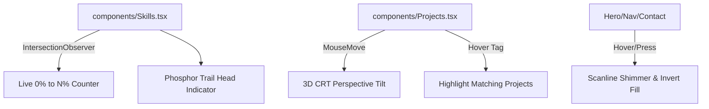

# CRT Portfolio UI Micro-Animations & Interactivity Plan

> **For agentic workers:** REQUIRED SUB-SKILL: Use superpowers:subagent-driven-development to implement this plan task-by-task. Steps use checkbox (`- [ ]`) syntax for tracking.

**Goal:** Enhance the portfolio's Skills, Projects, and Button components with interactive 3D CRT tilt effects, animated percentage counters, cross-project tech tag highlighting, and tactile CRT scanline button press states.

**Architecture:**
All animations leverage pure CSS3 keyframes, React state (`hoveredTech`, counter intervals), and HTML5 Pointer Event calculations (`onMouseMove` for 3D tilt). No external npm libraries are added.

**Architecture Diagram:**

**Tech Stack:** Next.js 15, TypeScript, Tailwind CSS v4, CSS Keyframes.

## Global Constraints

- **No Third-Party Animation Libraries**: Pure CSS & React hooks.
- **Colors**: Strictly `--amber: #ffb000`, `--amber-dim: #b07800`, `--green: #39ff14`, `--bg: #0a0800`, `--bg-panel: #0f0c00`.
- **Cursor**: `cursor: none` preserved across all elements.

---

### Task 1: Animated Skills Section & Live Counters (`components/Skills.tsx`)

**Files:**
- Modify: [`components/Skills.tsx`](file:///C:/Users/Dawood%20Tanvir/Desktop/Coding/my-portfolio-website/components/Skills.tsx)

- [ ] **Step 1: Add animated number counter state & phosphor head indicator to skill bars**
- [ ] **Step 2: Add row hover green phosphor glow highlight**
- [ ] **Step 3: Run type check**

---

### Task 2: Project Cards 3D CRT Tilt & Cross-Project Tech Tag Highlighting (`components/Projects.tsx`)

**Files:**
- Modify: [`components/Projects.tsx`](file:///C:/Users/Dawood%20Tanvir/Desktop/Coding/my-portfolio-website/components/Projects.tsx)

- [ ] **Step 1: Add 3D perspective tilt calculation on mouse move**
- [ ] **Step 2: Add `hoveredTech` state to highlight all projects matching hovered tech tag**
- [ ] **Step 3: Run type check**

---

### Task 3: Button Micro-Interactions & Global CSS Keyframes (`components/Hero.tsx`, `app/globals.css`)

**Files:**
- Modify: [`components/Hero.tsx`](file:///C:/Users/Dawood%20Tanvir/Desktop/Coding/my-portfolio-website/components/Hero.tsx)
- Modify: [`app/globals.css`](file:///C:/Users/Dawood%20Tanvir/Desktop/Coding/my-portfolio-website/app/globals.css)

- [ ] **Step 1: Add `@keyframes scanShimmer` in `app/globals.css`**
- [ ] **Step 2: Add tactile click down scale & glowing hover fill to CTA buttons**
- [ ] **Step 3: Verify end-to-end build**
