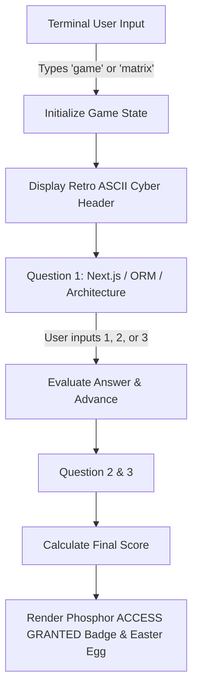

# CLI Terminal Retro Mini-Game Implementation Plan

> **For agentic workers:** REQUIRED SUB-SKILL: Use superpowers:subagent-driven-development to implement this plan task-by-task. Steps use checkbox (`- [ ]`) syntax for tracking.

**Goal:** Add a playable, retro CRT Cyber Hacker Quiz / Mini-Game to the interactive CLI modal ([`TerminalModal.tsx`](file:///C:/Users/Dawood%20Tanvir/Desktop/Coding/my-portfolio-website/components/TerminalModal.tsx)). Users can launch it by typing `game`, `matrix`, `play`, or `trivia` (or clicking the quick command pill `[game]`).

**Architecture:** Implement a mini-game state machine in `TerminalModal.tsx` with interactive question steps, command parsing for answers (`1`, `2`, `3`), real-time score tracking, retro ASCII art banners, and a victory reward badge upon completion.

**Architecture Diagram:**

**Tech Stack:** React 19, TypeScript, Tailwind CSS v4, CRT Phosphor Aesthetics.

## Global Constraints
- **Zero Disruptions**: Must preserve existing terminal commands (`help`, `about`, `projects`, `skills`, `contact`, `cat resume`, `reboot`, `clear`, `exit`).
- **Input Gating**: When a game session is active, input accepts numeric options (`1`, `2`, `3`) or `quit` to exit game mode cleanly.
- **CRT Aesthetics**: Styled with matrix green (`#39ff14`), CRT amber (`#ffb000`), and dark phosphor background (`#0f0c00`).

---

## Proposed Changes

### Component 1: `components/TerminalModal.tsx`

#### [MODIFY] [`components/TerminalModal.tsx`](file:///C:/Users/Dawood%20Tanvir/Desktop/Coding/my-portfolio-website/components/TerminalModal.tsx)

- Add state `gameState`: `{ active: boolean; currentQuestion: number; score: number } | null`.
- Add game questions dataset:
  1. *Q1*: "Which ORM is used for type-safe database queries in Project Relay?" -> `1: Prisma | 2: Drizzle ORM (Correct) | 3: Mongoose`
  2. *Q2*: "What state management library is paired with React Query in Hassan's stack?" -> `1: Zustand (Correct) | 2: Redux Toolkit | 3: Recoil`
  3. *Q3*: "Which real-time feature powers the Fit-Fusion AI SaaS feed?" -> `1: Polling | 2: Supabase WebSockets (Correct) | 3: Server Sent Events`
- Add command handlers for `game`, `play`, `matrix`, `trivia`.
- Handle in-game numeric inputs `1`, `2`, `3` or `quit`.
- Update quick commands list to include `[game]`.

---

## Verification Plan

### Automated Verification
1. **TypeScript Type Check**: `npx tsc --noEmit`
2. **Next.js Production Build**: `npm run build`

### Manual Verification
1. Open the Terminal Modal (click `[ >_ ]` trigger or press `Ctrl + K`).
2. Type `game` or click `[game]`.
3. Verify the retro ASCII header displays and Question 1 appears.
4. Input choices (`2`, `1`, `2`) and verify real-time answer evaluation.
5. Verify the final score and victory badge render correctly.
6. Type `help` or `clear` after the game to confirm normal terminal mode resumes seamlessly.
