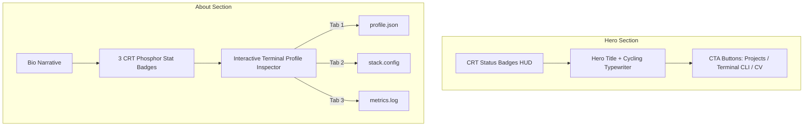

# Hero & About Section Enhancements Implementation Plan

> **For agentic workers:** REQUIRED SUB-SKILL: Use superpowers:subagent-driven-development to implement this plan task-by-task. Steps use checkbox (`- [ ]`) syntax for tracking.

**Goal:** Elevate the Hero and About sections into a state-of-the-art retro CRT experience featuring interactive HUD status badges, rotating cyber typewriter roles, multi-tab terminal profile Inspector (`profile.json`, `stack.config`, `metrics.log`), and phosphor metric counter cards.

**Architecture:** Update [`components/Hero.tsx`](file:///C:/Users/Dawood%20Tanvir/Desktop/Coding/my-portfolio-website/components/Hero.tsx) to support a cycling typewriter array and HUD telemetry badges. Update [`components/About.tsx`](file:///C:/Users/Dawood%20Tanvir/Desktop/Coding/my-portfolio-website/components/About.tsx) to include a tabbed JSON/config inspector and 3 CRT stat badges (`09+ Projects`, `02+ Years Exp`, `100% Type-Safe`).

**Architecture Diagram:**

**Tech Stack:** Next.js 16 (App Router), React 19, TypeScript, Tailwind CSS v4.

## Global Constraints
- **CRT Aesthetics**: Must strictly enforce matrix green (`#39ff14`), amber (`#ffb000`), and dark phosphor panel (`#0f0c00`) color tokens.
- **Responsiveness**: Minimum 44px touch targets on mobile, zero horizontal scroll overflow on 320px screens.
- **Performance**: Non-blocking typewriter intervals and smooth tab transitions.

---

## Proposed Changes

### Component 1: `components/Hero.tsx`

#### [MODIFY] [`components/Hero.tsx`](file:///C:/Users/Dawood%20Tanvir/Desktop/Coding/my-portfolio-website/components/Hero.tsx)

- Add rotating typewriter titles array:
  - `"Full-Stack Engineer for SaaS & MVP Delivery"`
  - `"Built & Shipped 9+ Web & Mobile Apps"`
  - `"Specializing in Next.js 16, React Native & .NET Core"`
- Add top HUD status bar: `[ SYSTEM: ONLINE ]`, `[ LATENCY: 24ms ]`, `[ AVAILABILITY: FREELANCE ]`.
- Add quick action button to open terminal modal directly from Hero.

---

### Component 2: `components/About.tsx`

#### [MODIFY] [`components/About.tsx`](file:///C:/Users/Dawood%20Tanvir/Desktop/Coding/my-portfolio-website/components/About.tsx)

- Convert to client component `"use client"`.
- Add 3 key CRT metric badges:
  - `[09+]` Production Applications Shipped
  - `[02+]` Years Full-Stack Engineering
  - `[100%]` Type-Safe & Tested Codebases
- Add interactive 3-tab terminal inspector for `profile.json`, `stack.config`, and `metrics.log`.

---

## Verification Plan

### Automated Verification
1. **TypeScript Type Check**: `npx tsc --noEmit`
2. **Next.js Production Build**: `npm run build`

### Manual Verification
1. Open the landing page and observe the Hero HUD badges and cycling typewriter text.
2. Click the `[ OPEN CLI TERMINAL ]` button in the Hero section to verify modal opening.
3. Scroll to `01 / About` and test clicking through the tabs (`profile.json`, `stack.config`, `metrics.log`).
4. Verify layout responsiveness on 375px mobile screen width.
