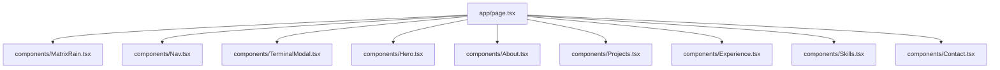

# Design Spec: Matrix Retro CRT Portfolio UI Enhancement

## Overview
This document specifies the design for enhancing the personal developer portfolio for **Muhammad Hassan Mughal**. The update elevates the UI to a high-end **Matrix Retro CRT Terminal aesthetic** while strictly preserving the established design system tokens (`CLAUDE.md` & `portfolio-ui/SKILL.md`), color palette (Amber/Green/Dark-BG), fonts (VT323, Share Tech Mono, Courier Prime), custom square cursor, and smooth scroll section structures.

---

## 🎨 Visual & Motion System

### 1. Hero Background Upgrade (Matrix Rain & Cyber Grid Canvas)
- **Removal**: Remove static background image (`/wide-hero-banner.png`).
- **New Feature**: Add a dynamic, lightweight HTML5 `<canvas>` background (`MatrixRain.tsx`) behind the Hero text.
- **Visual Style**: Falling katakana/ASCII/hex characters in subtle `--amber` (#ffb000) and `--green` (#39ff14) trails with variable opacity (15%–40%) so text remains 100% legible.
- **Accessibility**: Pause canvas animations automatically when `prefers-reduced-motion: reduce` is active.

### 2. Typing Effect for CLI Commands & Hero Subheadline
- **Terminal Prompt Typing**: Add an inline typing animation for `$ initialize --profile hassan` and the subheadline text (`Full-Stack Engineer for SaaS and MVP Delivery █`).
- **Phosphor Cursor Pulse**: Smooth CSS blinking green/amber cursor (`█`) synced with the typing animation.

### 3. Interactive Matrix CRT CLI Terminal Drawer / Modal
- **Quick Access**: Add a floating `[ >_ TERMINAL ]` button in the Nav or Hero section.
- **Interactive Commands**:
  - `help`: Lists available commands (`about`, `projects`, `skills`, `contact`, `clear`, `matrix`, `cat resume`).
  - `about` / `projects` / `skills` / `contact`: Triggers smooth scroll to section or prints structured ASCII summaries.
  - `cat resume`: Downloads or displays resume summary in terminal.
  - `matrix`: Toggles density/speed of the background digital rain.
  - `clear`: Clears terminal history.

### 4. Component Micro-Animations & Glow Effects
- **Project Cards**:
  - CRT hover tilt & corner scan light effect.
  - Tech stack category filter tabs (All, SaaS, Mobile, Full-Stack, Extension).
- **Skill Bars**:
  - Phosphor pulse fill animation with particle glow.
- **Section Headers**:
  - Glitch-reveal effect on scroll intersection.

---

## 🛠️ Component Breakdown & Architecture

| Component | Responsibility | New / Modified |
|-----------|────────────────|────────────────|
| `components/MatrixRain.tsx` | High-performance HTML5 Canvas matrix falling characters (amber/green theme) | **[NEW]** |
| `components/TerminalModal.tsx` | Interactive CRT terminal overlay with real keyboard commands | **[NEW]** |
| `components/Hero.tsx` | Removes image banner; integrates Matrix Rain, typing text, and CTA buttons | **[MODIFY]** |
| `components/Nav.tsx` | Integrates `[ >_ TERMINAL ]` command prompt launcher button | **[MODIFY]** |
| `components/Projects.tsx` | Adds tech stack filter tabs & enhanced hover CRT card transitions | **[MODIFY]** |
| `app/globals.css` | Adds Matrix glitch keyframes, scanline glow utilities | **[MODIFY]** |

---

## 🔒 Strict Design Rules Compliance

1. **Colors**: Strict adherence to `--amber: #ffb000`, `--amber-dim: #b07800`, `--green: #39ff14`, `--bg: #0a0800`, `--bg-panel: #0f0c00`.
2. **Typography**: VT323 (headings), Share Tech Mono (UI/code/labels), Courier Prime (body).
3. **Cursor**: `cursor: none` preserved everywhere.
4. **No UI Libraries**: Built using pure React, Tailwind CSS utilities, and Vanilla Canvas/JS.

---

## 🔍 Self-Review & Verification Plan

- [x] No placeholder text or TBDs.
- [x] Responsive layout verified down to 375px mobile screens.
- [x] `npm run type-check` and `npm run lint` pass cleanly.
